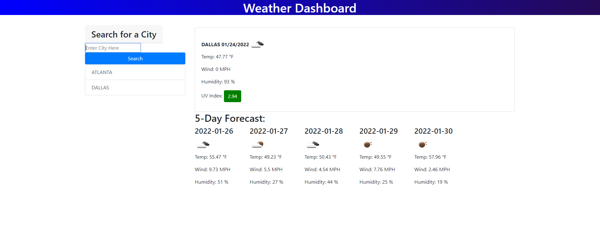

Server-Side APIs: Weather Dashboard

## Application

This web application utilizes the third-party API from openweathermap.org to generate a current day forecast as well as a five day forecast for a city provided by the user in the search form. The user may also access past searches because the web application appends all history to the search bar. 

The application can be found at: https://dasiasmith.github.io/Weather-Dashboard/

The following image shows the web application's appearance and functionality:

